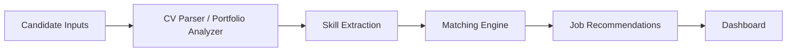

# CareerScope AI — CV, Portfolio & Job-Market Matching Platform

[](https://github.com/OWNER/REPOSITORY/actions/workflows/ci.yml)

CareerScope AI analyzes a candidate's CV and portfolio, maps skills to target roles, compares
them against job-market demand, identifies missing skills, and recommends matching jobs with
explainable scores.

The project is built as a recruiter-friendly MVP that demonstrates backend API design, local data
ingestion, deterministic NLP-style parsing, explainable scoring, Streamlit product UX, Dockerized
deployment, and CI-ready Python engineering.

## Features

- CV parsing for TXT and PDF files
- GitHub and portfolio link analysis
- taxonomy-backed skill extraction
- target-role skill-gap analysis
- explainable candidate-to-job matching
- ranked job recommendation engine
- job market analytics dashboard foundation
- FastAPI backend
- Streamlit frontend
- SQLite local MVP storage
- Docker Compose deployment
- tests and GitHub Actions CI

## Architecture



## Tech Stack

- Python 3.11+
- FastAPI
- Streamlit
- SQLite
- SQLAlchemy 2.x
- Pydantic v2
- Pandas
- scikit-learn
- PyMuPDF
- pytest
- ruff
- Docker Compose

## Screenshots

Screenshots are intended to live in:

```text
docs/screenshots/
```

Suggested portfolio screenshots:

- `docs/screenshots/01_candidate_profile.png`
- `docs/screenshots/02_cv_skills.png`
- `docs/screenshots/03_skill_gap.png`
- `docs/screenshots/04_job_recommendations.png`

## API Examples

Create a candidate:

```bash
curl -X POST http://localhost:8000/candidates \
  -H "Content-Type: application/json" \
  -d '{
    "full_name": "Alex Morgan",
    "email": "alex@example.com",
    "target_field": "Computer Science",
    "target_job_title": "Data Engineer",
    "seniority_preference": "Mid",
    "location_preference": "Athens",
    "remote_preference": "Hybrid"
  }'
```

Upload a CV:

```bash
curl -X POST http://localhost:8000/candidates/1/cv \
  -F "cv=@data/sample/sample_cv_data_engineer.txt"
```

Analyze portfolio links:

```bash
curl -X POST http://localhost:8000/candidates/1/portfolio \
  -H "Content-Type: application/json" \
  -d '{
    "urls": [
      "https://github.com/example/data-pipeline",
      "https://example.com/portfolio"
    ]
  }'
```

Run a skill-gap report:

```bash
curl -X POST http://localhost:8000/matching/1/skill-gap \
  -H "Content-Type: application/json" \
  -d '{
    "target_field": "Computer Science",
    "target_job_title": "Data Engineer"
  }'
```

Recommend jobs:

```bash
curl -X POST http://localhost:8000/matching/1/recommend-jobs \
  -H "Content-Type: application/json" \
  -d '{
    "target_field": "Computer Science",
    "target_job_title": "Data Engineer",
    "limit": 10
  }'
```

## Example Output

Sample skill-gap report:

```json
{
  "target_field": "Computer Science",
  "target_job_title": "Data Engineer",
  "overall_readiness_score": 72.5,
  "strong_skills": ["Python", "SQL", "Docker"],
  "partial_skills": ["Spark", "PostgreSQL"],
  "missing_skills": ["Airflow", "dbt", "data quality", "Kafka"],
  "portfolio_evidenced_skills": ["Python", "Docker"],
  "recommended_projects": [
    "Build an ELT pipeline with Airflow, dbt, PostgreSQL, Great Expectations, Docker, and a dashboard."
  ],
  "recommended_learning_topics": ["Airflow", "dbt", "data quality", "Kafka"],
  "explanation": "Readiness for Data Engineer is 72/100 based on relevant job postings."
}
```

Sample job recommendation:

```json
{
  "title": "Data Engineer",
  "company": "Northwind Analytics",
  "location": "Athens",
  "overall_score": 86.5,
  "match_label": "strong",
  "matching_skills": ["Python", "SQL", "Spark", "Docker"],
  "missing_skills": ["Airflow"],
  "explanation": "Matching skills and portfolio evidence are strong, but Airflow is a gap."
}
```

## Local Setup

Create and activate a virtual environment:

```bash
python -m venv .venv
```

Windows PowerShell:

```powershell
.\.venv\Scripts\Activate.ps1
```

macOS/Linux:

```bash
source .venv/bin/activate
```

Install requirements:

```bash
python -m pip install --upgrade pip
python -m pip install -r requirements.txt
```

Copy environment defaults:

```bash
cp .env.example .env
```

Windows PowerShell:

```powershell
Copy-Item .env.example .env
```

Initialize the database:

```bash
python scripts/init_db.py
```

Import sample jobs:

```bash
python scripts/import_sample_jobs.py
```

Run the backend:

```bash
make run-api
```

Run the frontend in a second terminal:

```bash
make run-ui
```

Open:

```text
Backend API: http://localhost:8000
API docs: http://localhost:8000/docs
Streamlit UI: http://localhost:8501
```

## Docker Setup

Build and start both services:

```bash
make docker-build
make docker-up
```

Initialize the Docker database:

```bash
docker compose exec backend python scripts/init_db.py
```

Import sample jobs into the Docker database:

```bash
docker compose exec backend python scripts/import_sample_jobs.py
```

View logs:

```bash
make docker-logs
```

Stop services:

```bash
make docker-down
```

Docker exposes:

```text
Backend API: http://localhost:8000
Streamlit UI: http://localhost:8501
```

The Docker frontend calls the backend through the Compose service network at:

```text
http://backend:8000
```

## Development Commands

```bash
make install
make run-api
make run-ui
make test
make lint
make format
make docker-build
make docker-up
make docker-down
make docker-logs
```

## Project Structure

```text
CareerScope_AI/
|-- backend/
|   |-- app/
|   |   |-- api/
|   |   |-- db/
|   |   |-- job_collector/
|   |   |-- matching/
|   |   |-- models/
|   |   |-- portfolio_analyzer/
|   |   |-- schemas/
|   |   |-- services/
|   |   `-- skill_extraction/
|   `-- tests/
|-- frontend/
|   `-- streamlit_app.py
|-- data/
|   |-- sample/
|   `-- taxonomies/
|-- docs/
|   |-- screenshots/
|   |-- architecture.md
|   |-- data_model.md
|   `-- roadmap.md
|-- scripts/
|-- Dockerfile.backend
|-- Dockerfile.frontend
`-- docker-compose.yml
```

## Roadmap

- real job API integration
- ESCO/O*NET taxonomy integration
- authentication
- PostgreSQL migration
- ML role classifier
- vector search
- LLM-generated explanations
- deployed demo

## Limitations

- MVP uses sample job data.
- Matching is explainable but approximate.
- No LinkedIn or Indeed scraping is included.
- External URLs may fail due to network limits, rate limits, or unavailable pages.
